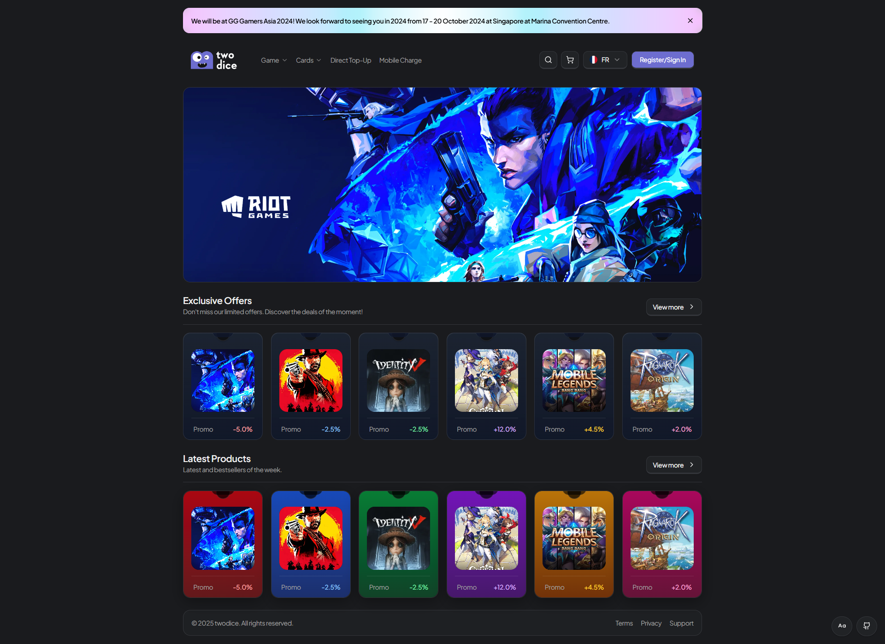

## twodice 🎲

A playful side project made just for fun — exploring a digital game & gift cards storefront UI with Next.js, TypeScript, Tailwind CSS, and shadcn/ui. No commercial intent; this is purely an UI/UX exercise and sandbox. ✨

### Tech Stack ⚙️
- Next.js 15.4.6 (App Router)
- React 19.1.0
- TypeScript
- Tailwind CSS 4.x
- shadcn/ui (Radix UI, lucide-react)

### Features 🎮
- Responsive, accessible layout
- Reusable UI sections and cards
- Clean theming with Tailwind
- Local-only data, no external APIs

### Local Development 💻
1. Install dependencies with your preferred package manager (Bun, pnpm, npm, or Yarn).
2. Start the dev server.
3. Open `http://localhost:3000` in your browser. Hot reload is enabled.

### Project Structure 🗂️
- `app/`: pages and screen-level components
- `components/`: reusable UI blocks and sections
- `lib/`: shared utilities
- `public/`: static assets

### Design Credits 🙏
Inspired by [“Digital game and gift cards website”](https://dribbble.com/shots/23553676-Digital-game-and-gift-cards-website) on Dribbble

This implementation is unofficial and for educational/recreational purposes only. It is not affiliated with any brands, games, or the original creator. 📌
